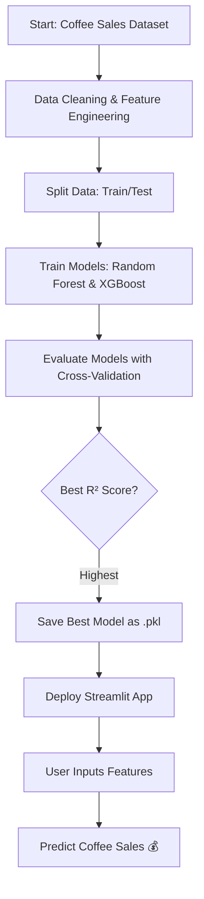

# ☕ Coffee Sales Predictor  

Predict daily coffee sales using machine learning models trained on the **Coffee Sales Dataset**. This project uses **Random Forest** and **XGBoost**, selecting the best-performing model and deploying it as a **Streamlit web app** with a user-friendly interface.

---

## 📌 Features  
- ✅ **Machine Learning Pipeline**: Preprocessing, feature engineering, and hyperparameter tuning.  
- ✅ **Best Model Selection**: Compares Random Forest and XGBoost regressors.  
- ✅ **Streamlit App**: Clean, modern UI with dynamic CSS.  
- ✅ **Reusable Model**: Saved as a `.pkl` file for easy predictions.  
- ✅ **Cross-Validation**: Ensures robust model performance.  

---

## 🛠 Tech Stack  
- **Python** (Pandas, NumPy, Scikit-learn, XGBoost, Joblib)  
- **Streamlit** for deployment  
- **Mermaid** for flowchart visualization  

---

## 📂 Project Structure  
``` coffee-sales-predictor/
│
├── best_coffee_sales_model.pkl # Trained ML model
├── Coffe_sales.csv # Dataset (from Kaggle)
├── app.py # Streamlit application
├── requirements.txt # Dependencies
└── README.md # Project documentation
```
---

---

## 🖇 Flowchart of Workflow  


---
🚀 Getting Started
1️⃣ Clone the repository
```
git clone https://github.com/your-username/coffee-sales-predictor.git
cd coffee-sales-predictor
```
2️⃣ Install dependencies
```
pip install -r requirements.txt
```
3️⃣ Run the Streamlit app
```
streamlit run app.py
```
---
📊 Example Prediction

| Feature     | Example Value |
| ----------- | ------------- |
| Coffee Type | Latte         |
| Time of Day | Morning       |
| Hour of Day | 9             |
| Weekday     | Monday        |
| Month       | March         |


